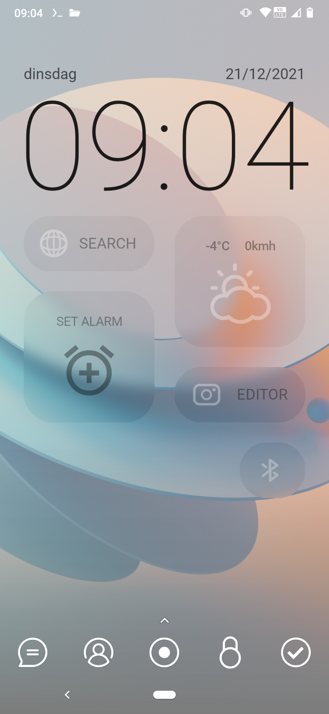
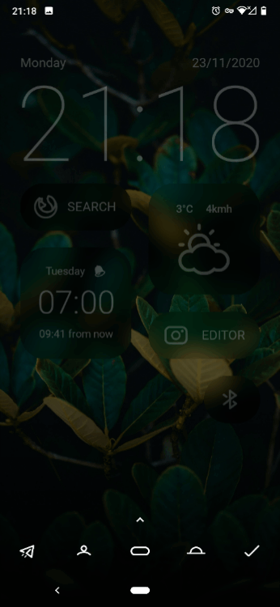
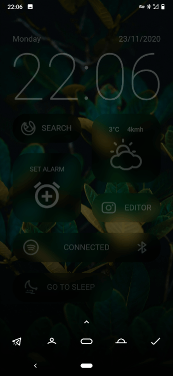

# Download & Install

1. Download & install the <a target="_blank" href="https://play.google.com/store/apps/details?id=org.kustom.wallpaper&hl=en_US&gl=US">KLWP</a> Android app.
2. Download the latest version of <a target="_blank" href="https://github.com/HanneMaes/Tyler-homescreen/tree/main/Homescreen">Tyler</a>.
3. Download & install <a target="_blank" href="https://play.google.com/store/apps/details?id=com.llamalab.automate&hl=en_US&gl=US">Automate</a>
4. Download & inport the Automate tasks.
5. Open KLWP and load the .klwp file.

# Features

## Adaptive brightness

Tyler makes text more readable in bright light and less blinding in low light.

## Sleep mode

Between 22:00 and 08:00 the **Go to sleep** tile appears.

During sleep mode:
- A button is shown to **quickly** toggle the **flashlight/torch**.
- **Screen brightness** is set to **0**, **auto brightness is turned off**.
- **Airplane mode** is turned on.

## Tiles

- **The date, time and day of the week tile** opens the default calendar app.
- **The internet tile** opens the default browser and Google Search app.
- **The weather tile** displays today's temperate, wind speed and weather forecast icon. 
Tap to open the default weather app.
- **The alarm tile** shows the next alarm and how long unit that alarm. 
Tap to open the default alarm app.

- **The camera tile** opens the camera or the default photo editing app.
- **The Bluetooth tile** shows connection status and opens default music player.

# Backgrounds

Tyler works with a variaty of backgrounds. 
All the example wallpapers are included.

# Automate
<a target="_blank" href="https://play.google.com/store/apps/details?id=com.llamalab.automate&hl=en_US&gl=US">Automate</a> is used to preform the follow tasks:

**Bluetooth tile:**
- Toggle Bluetooth.

**Sleep mode:**
- Set brightness and turn off auto brightness.
- Toggle airplane mode.

# Tasker

<a target="_blank" href="https://play.google.com/store/apps/details?id=net.dinglisch.android.taskerm&hl=en_US&gl=US">Tasker</a> was used to preform the follow tasks:

**Sleep mode:**
- Toggle flashlight/torch.